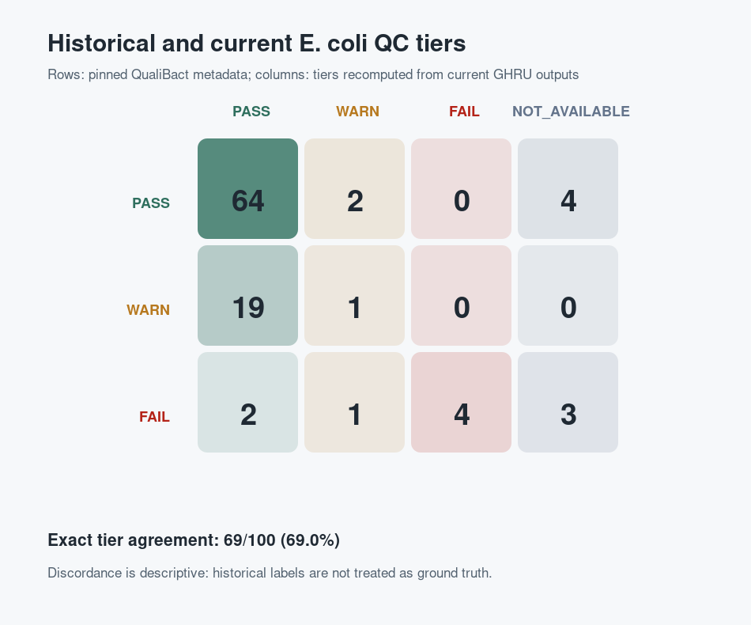
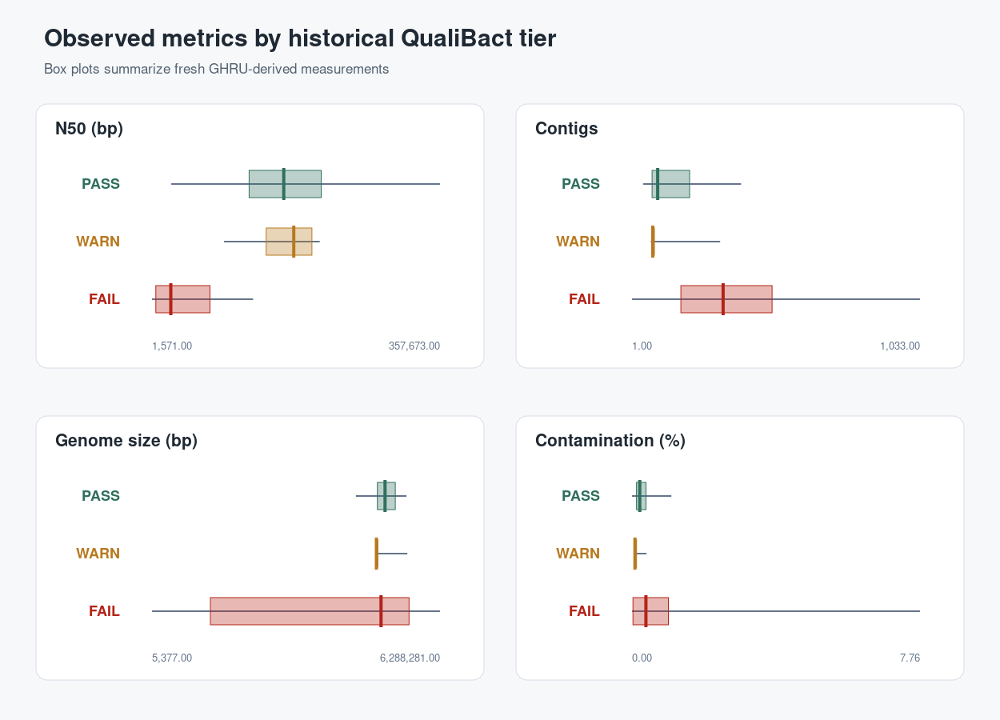
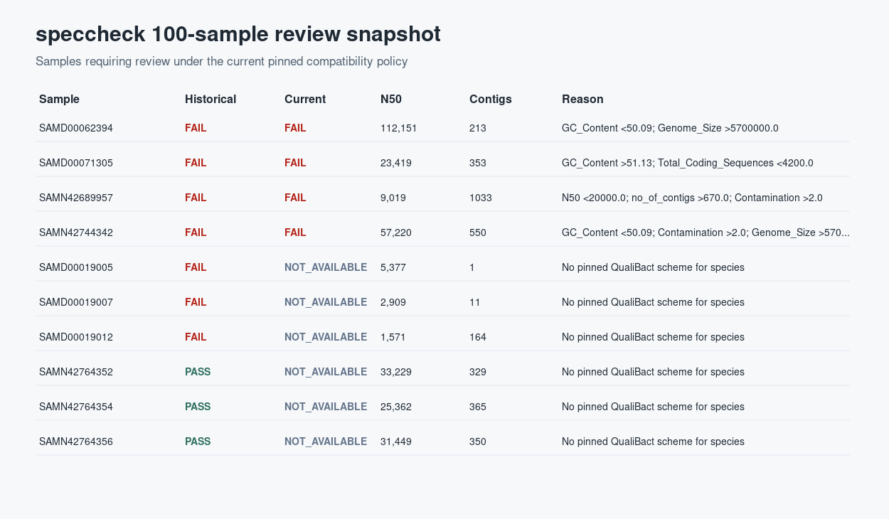

# 100-sample E. coli Case Study

This worked example shows Speccheck on a realistic cohort rather than a toy
fixture. The input reads were processed through GHRU Assembly and the compact
published QC outputs were summarised with Speccheck.

The committed example is intentionally compact. It includes reports, accessions,
analysis tables, figures, and provenance; it does not include raw reads,
assemblies, databases, or Nextflow work directories.

## Files to look at

| Path | What it is |
| --- | --- |
| `examples/qualibact_ecoli/real_run_100/cohort_accessions.csv` | selected accessions and metadata |
| `examples/qualibact_ecoli/real_run_100/report/report.csv` | compact Speccheck cohort report |
| `examples/qualibact_ecoli/real_run_100/report/report.full.csv` | wide report with parser/provenance columns |
| `examples/qualibact_ecoli/real_run_100/report/report.html` | interactive review report |
| `examples/qualibact_ecoli/real_run_100/analysis/tier_concordance.csv` | historical tier vs current compatibility tier |
| `examples/qualibact_ecoli/real_run_100/analysis/discordant_samples.csv` | samples where tiers differ |
| `examples/qualibact_ecoli/real_run_100/analysis/summary.json` | provenance and headline counts |

## What the example demonstrates

The case study demonstrates three things:

1. Speccheck can summarise outputs from a real workflow run.
2. The final report is small enough to commit and review.
3. Threshold provenance is explicit: the report records Speccheck version,
   criteria path, criteria checksum, and threshold source.

## Results at a glance

The completed 100-sample run produced:

- 85 current compatibility PASS samples;
- 4 current compatibility WARN samples;
- 4 current compatibility FAIL samples;
- 7 current compatibility NOT_AVAILABLE samples;
- 69/100 exact tier agreement with the historical labels;
- 3 samples with unidentified Speciator results.

These values describe concordance between historical labels and current
measurements. They are not sensitivity or specificity estimates, because the
historical labels are not treated as ground truth.

`NOT_AVAILABLE` is deliberate here. The compatibility overlay is pinned to an
E. coli QualiBact threshold set, so Speccheck does not invent an E. coli
compatibility tier when the current species assignment falls outside that pinned
policy or cannot be identified.



## Metric distributions

The metric distribution figure is useful for seeing why WARN/FAIL decisions
happen. It highlights assembly and contamination metrics by historical tier.



## Report snapshot

The HTML report is intended for interactive review. It starts with cohort-level
counts, then moves into sample review, warning/failure reasons, metric summaries,
software diagnostics, and a collapsible full-detail table.



## Recreate derived assets

```bash
pixi run python scripts/create_real_run_100_assets.py
```

This regenerates the derived analysis CSVs, figures, and provenance summary from
the committed report files.

## Interpretation boundary

The compatibility overlay is pinned to QualiBact *E. coli* v1. It should not be
described as general multi-species QualiBact parity. Other species may have
different threshold versions, different available metrics, or no species-specific
threshold for a given metric.
