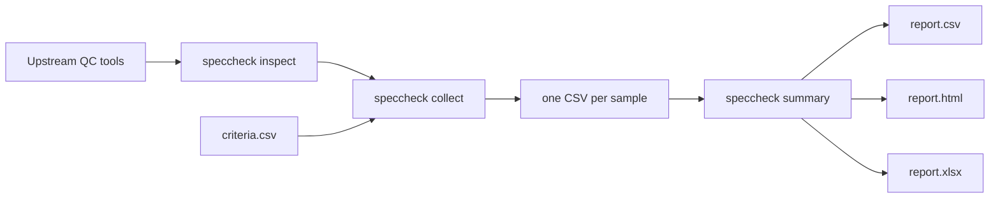

# Speccheck

Turn a directory of bacterial QC outputs into one reviewable decision table.

`speccheck` sits after tools such as QUAST, CheckM2, Speciator, Sylph, Fastp,
BUSCO, ARIBA, or a workflow such as GHRU Assembly. It detects recognised output
files, applies an explicit criteria CSV, and writes compact CSV, HTML, and XLSX
reports that can be checked by a person and reproduced later.

<div class="grid cards" markdown>

-   :material-file-search-outline: **Find the evidence**

    Detect QC files with `speccheck inspect` before writing anything.

-   :material-table-check: **Apply transparent thresholds**

    Use species-specific rows where available and generic rows where not.

-   :material-chart-box-outline: **Review a cohort**

    Generate concise CSV, wide CSV, XLSX, and interactive HTML reports.

-   :material-source-branch: **Fit a pipeline**

    Use `collect-pipeline --layout ghru` or wire `collect` and `summary` into a
    new workflow.

</div>

## The core workflow



## Install

The published package name is `speccheck-qc`; the command it installs is
`speccheck`.

```bash
python -m pip install speccheck-qc
speccheck --help
```

Use an editable source install only if you are developing Speccheck itself.

## A minimal example

Collect one sample:

```bash
speccheck collect path/to/sample_qc/ \
  --sample SAMPLE_001 \
  --organism "Escherichia coli" \
  --assembly-type short \
  --output-file qc_collect/SAMPLE_001.csv
```

Summarise a folder of collected samples:

```bash
speccheck summary qc_collect \
  --output qc_report \
  --plot \
  --xlsx-output qc_report/report.xlsx
```

Start with [Quick Start](quickstart.md) if you have QC files already. If you are
wiring a workflow, read [Pipeline Integration](ghru.md). If you want to understand
thresholds, read [Criteria and Thresholds](criteria.md).

!!! tip "What makes Speccheck useful?"

    It does not replace upstream QC tools. It makes their outputs comparable by
    applying one criteria table and recording the threshold source, criteria
    checksum, Speccheck version, and input-file count in the output.

## Worked example: 100 real read-backed genomes

The repository includes a compact 100-sample *E. coli* case study generated from
GHRU Assembly outputs. It shows the intended use of Speccheck on a realistic
cohort without committing raw reads or workflow work directories.

The committed example contains:

- accessions and selection metadata;
- Speccheck `report.csv`, `report.full.csv`, `report.html`, and `report.xlsx`;
- concordance, discordance, and metric-distribution summaries;
- figures and provenance needed to understand the run.

Read [Worked Examples](worked-examples.md) for step-by-step commands and
[100-sample E. coli case study](case-study.md) for the results.
