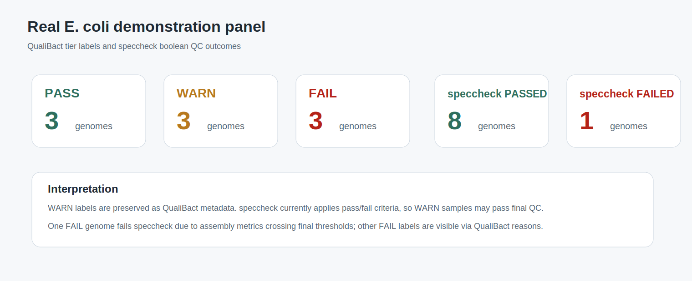
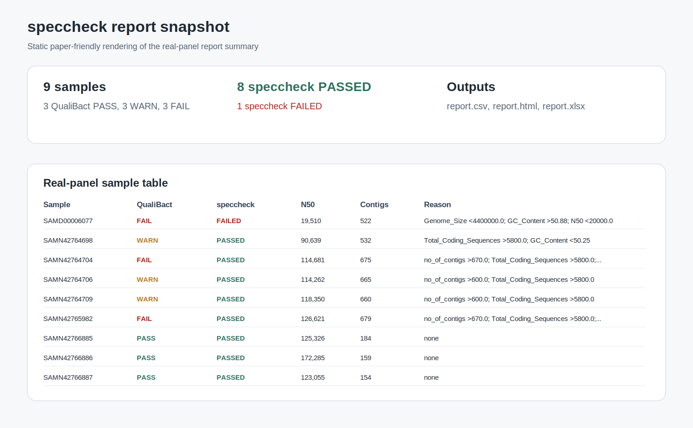

# Manuscript Assets

This page collects the example data, report outputs, and figure-generation commands intended for manuscript preparation.

## Example report sets

The repository includes three E. coli report sets:

| Example | Purpose | Outputs |
| --- | --- | --- |
| `examples/qualibact_ecoli/pass_only/` | minimal passing example | `report.csv`, `report.html`, `report.xlsx` |
| `examples/qualibact_ecoli/fail_only/` | minimal failing example | `report.csv`, `report.html`, `report.xlsx` |
| `examples/qualibact_ecoli/real_panel/` | real QualiBact ATB PASS/WARN/FAIL panel | `report.csv`, `report.html`, `report.xlsx` |

The HTML reports are self-contained and embed the report stylesheet, so they can be attached to manuscript supplements without a companion CSS file.

## Regenerate minimal reports

```bash
python scripts/generate_qualibact_example_reports.py
```

This refreshes the minimal pass/fail reports from pinned fixtures under `tests/qualibact/`.

## Regenerate the real QualiBact panel

Rebuild the committed `real_panel` report directly from a finished local GHRU run:

```bash
pixi run python scripts/build_ghru_ecoli_panel_report.py \
  .demo_work/ghru_ecoli_panel/triplet/output \
  --metadata .demo_work/ghru_ecoli_panel/triplet/metadata.csv \
  --work-dir .demo_work/ghru_ecoli_panel/triplet/work
```

This route preserves the real upstream `GHRU-assembly` metrics that `speccheck` should consume in production.

## Export report screenshots

Use the screenshot helper when a headless browser is available:

```bash
scripts/export_report_screenshots.sh
```

By default, screenshots are written to `examples/qualibact_ecoli/figures/`:

- `pass_only_report.png`
- `fail_only_report.png`
- `real_panel_report.png`

The script supports Chromium, Chrome, or Firefox. On some HPC login nodes Firefox headless mode can fail because browser profile and graphics services are restricted; in that case run the script on a workstation or an interactive node with a working headless browser.

## Suggested manuscript figures

- **Figure 1:** `speccheck` workflow diagram: upstream QC tools, `collect`, criteria checks, `summary`, and report outputs.
- **Figure 2:** Real QualiBact E. coli PASS/WARN/FAIL panel outcomes.
- **Figure 3:** Static report snapshot showing the real-panel summary table.
- **Supplementary Figure 1:** Passing-only report screenshot.
- **Supplementary Figure 2:** Failing-only report screenshot with failure reasons.

### Figure 1: workflow


Source files:

- `examples/qualibact_ecoli/manuscript_assets/speccheck_workflow.svg`
- `examples/qualibact_ecoli/manuscript_assets/speccheck_workflow.png`

### Figure 2: real-panel outcomes



Source files:

- `examples/qualibact_ecoli/manuscript_assets/real_panel_outcomes.svg`
- `examples/qualibact_ecoli/manuscript_assets/real_panel_outcomes.png`

### Figure 3: report snapshot



Source files:

- `examples/qualibact_ecoli/manuscript_assets/real_panel_report_snapshot.svg`
- `examples/qualibact_ecoli/manuscript_assets/real_panel_report_snapshot.png`

## Suggested manuscript table

Use `examples/qualibact_ecoli/real_panel/report/report.csv` to summarize the real-panel benchmark. Useful columns include:

- `sample_id`
- `qualibact_tier`
- `qualibact_compat_tier`
- `qualibact_compat_reasons`
- `qualibact_compat_warn_policy`
- `all_checks_passed`
- `Quast.N50`
- `Quast.# contigs (>= 0 bp)`
- `Checkm.Completeness`
- `Checkm.Contamination`
- `qualibact_reasons`

A paper-ready subset is generated here:

- `examples/qualibact_ecoli/manuscript_assets/real_panel_summary_table.csv`
- `examples/qualibact_ecoli/manuscript_assets/real_panel_summary_table.md`

Preview:

--8<-- "examples/qualibact_ecoli/manuscript_assets/real_panel_summary_table.md"

## Current limitation

The current committed real-panel report is based on a small validated GHRU-backed triplet, not yet on a larger read-backed cohort. The remaining scale-up work should stay on the same GHRU path rather than reintroducing assembly-only fixtures.

CheckM1 marker-lineage output is not used for the QualiBact comparison, because
the imported thresholds are calibrated around CheckM2 metrics.
